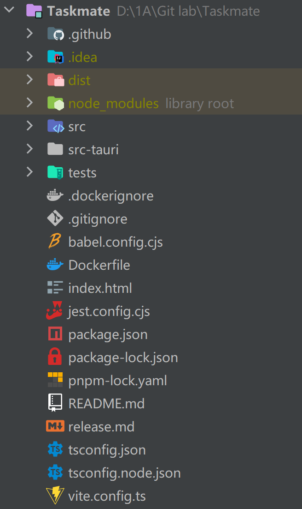
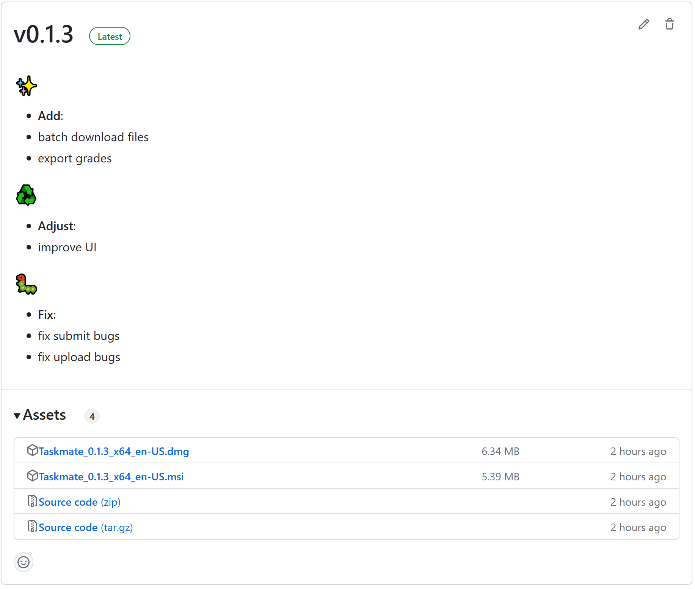
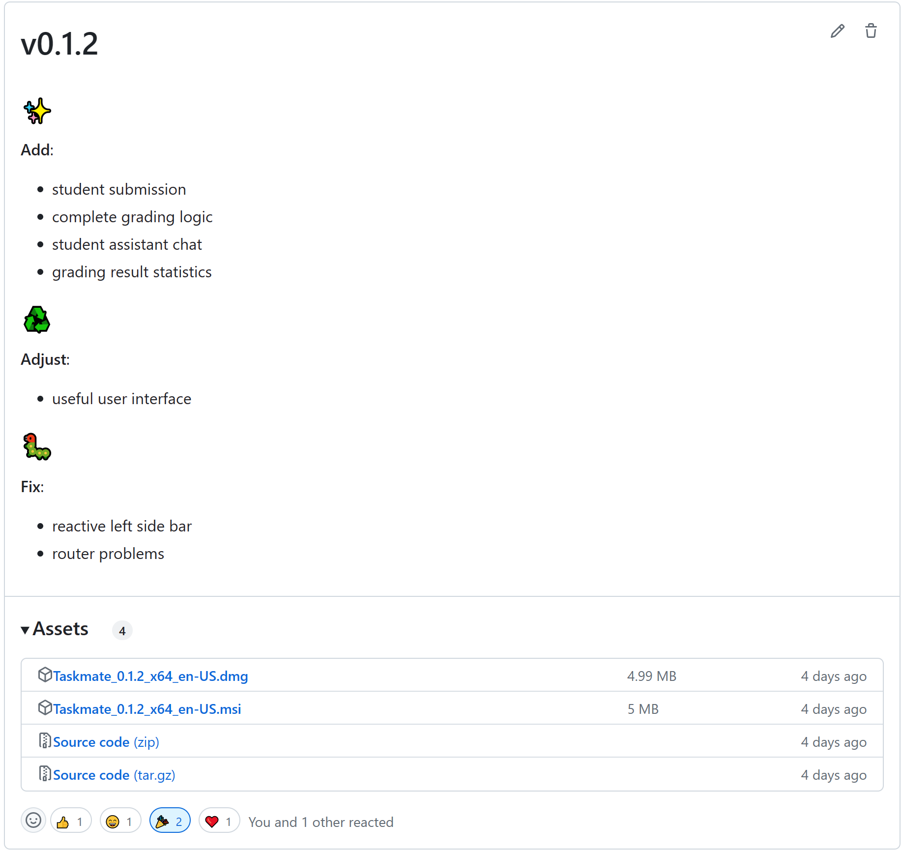
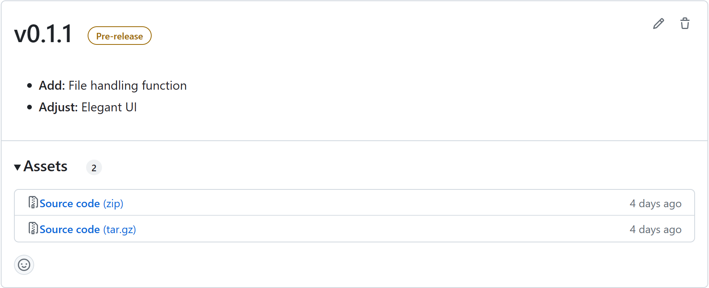
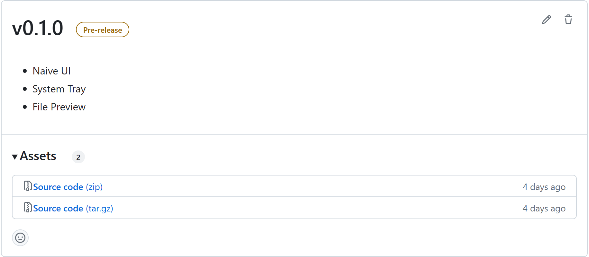

# Taskmate Project Developer Document

### 1. Project Introduction

Taskmate is a cross-platform desktop application that allows SUSTech students, teachers, and student assistants to log in, upload homework, collaborate in real-time on grading assignments, and view score statistics using their spaces.sustech.cloud account.

### 2. Development Environment

- **Operating System:** Windows 10, MacOS, Linux
- **Development Tools:** Idea, VSCode
- **Program Language:** rust, Vue, HTML, CSS, SCSS, TypeScript, JavaScript
- **Technology Stack:** Tauri
- **Package Manager:** *Cargo* for Rust and *pnpm* for Vue
- **Version Control:** GitHub
- **How to Run the Program:** 
  - Install Rust and configure Tauri in your local machine.
  - Install npm and run `npm install pnpm` to install pnpm in your local machine.
  - To run the project in the development environment, open the project first, enter the root path, then type `pnpm tauri dev` in the cmd.
  - To build the whole project, open the project first, enter the root path, then type `tauri build` in the cmd.

### 3. Project Dependencies

#### 3.1 Cargo

```rust
tauri = { version = "1.2", features = ["dialog-all", "fs-all", "http-all", "http-multipart", "path-all", "protocol-all", "shell-open", "system-tray"] }
serde = { version = "1.0", features = ["derive"] }
serde_json = "1.0"
reqwest = { version = "0.11", features = ["blocking", "json", "multipart"] }
tokio = { version = "1", features = ["full"] }
hyper = { version = "0.14", features = ["full"] }
zip = "0.6.4"
anyhow = "*"
flate2 = "1.0.25"
tar = "0.4.38"
walkdir = "2.3.3"
url = "2.3.1"
tauri-plugin-deep-link = "0.1.1"
mime = "0.3.17"
base64 = "0.21.0"
```

- **tauri**: An open-source toolkit that aims to provide developers with a simple way to build desktop applications, supporting the use of web technologies (HTML/CSS/JS) to construct native GUI applications that are cross-platform (Windows/macOS/Linux).
- **serde/serde_json**: Two Serde libraries used for serializing and deserializing Rust data structures. They can convert data to other storage formats, such as JSON, and parse data from other storage formats.
- **reqwest**: A Rust HTTP client library that enables asynchronous or synchronous HTTP requests and supports JSON parsing, file uploading, and other functions.
- **tokio**: An asynchronous runtime library that allows Rust programs to implement an asynchronous programming model.
- **hyper**: A high-performance HTTP server and client based on Tokio implementation.
- **zip**: A library for compressing and decompressing ZIP files.
- **anyhow**: A library used for handling error cases, provides a set of Error types, macros, and functions that make error-handling code clearer and easier to read.
- **flate2**: A compression algorithm library that provides support for compressing and decompressing Gzip and zlib formats.
- **tar**: A library for reading and writing *tar* files.
- **walkdir**: A library for quickly recursively traversing a directory.
- **url**: A library for handling URLs.
- **tauri-plugin-deep-link**: A plugin that provides deep link support for the Tauri framework.
- **mime**: A MIME file type recognition library that returns inferred MIME types based on file names or extensions.
- **base64**: A library that provides Base64 encoding and decoding functionality.

#### 3.2 pnpm

```json
"@kangc/v-md-editor": "^2.1.7"
"@tauri-apps/api": "^1.2.0"
"@vueuse/core": "^9.13.0"
"crypto-js": "^4.1.1"
"echarts": "^5.4.2"
"element-plus": "^2.3.0"
"lodash": "^4.17.21"
"moment": "^2.29.4"
"next": "^13.4.3"
"pinia": "^2.0.34"
"pnpm": "^7.29.1"
"prismjs": "^1.29.0"
"vue": "^3.2.47"
"vue-pdf-embed": "^1.1.6"
"vue-router": "^4.1.6"
"vue-template-compiler": "^2.7.14"
"vuex": "^4.1.0"
```

- **@kangc/v-md-editor**: A visual editor for rendering Markdown inside a Vue application.
- **@tauri-apps/api**: A JS/TS library used in the Tauri framework to access the Tauri API, providing a set of cross-platform APIs with which developers can access operating system functions.
- **@vueuse/core**: A Vue plugin that integrates a large number of useful custom Vue Hooks.
- **crypto-js**: A JavaScript encryption algorithm library that supports multiple encryption algorithms.
- **echarts**: A JavaScript-based visualization chart library.
- **element-plus**: A commonly used UI component library that includes widgets such as tables, pop-up windows, date pickers, and paginators.
- **lodash**: A utility library that provides many easy-to-use functions to help complete tasks, such as manipulating objects, arrays, strings, etc.
- **moment**: A time processing library used for formatting, displaying, parsing, and manipulating time.
- **next**: A package providing server-side rendering, automatic code splitting, and optimization for Vue applications.
- **pinia**: A Vue state management library that makes Vue state management simpler and clearer.
- **pnpm**: An alternative package management tool to NPM and Yarn, faster and space-saving.
- **prismjs**: A syntax highlighting library that can make code clearer and easier to understand.
- **vue**: The framework that we use in this project.
- **vue-pdf-embed**: A VueJS component (PDF Embed) that can encapsulate PDF files in preview form.
- **vue-router**: The official Vue router library used to implement client-side routing.

### 4. Project Structure



- `.github` CI/CD files
- `.idea` IDE configuration files
- `dist` Final production code and resources for the project
- `node_modules` Library root
- `src` Frontend files (Vue3 project)
- `src-tauri` Backend files (Rust Cargo project)
- `tests` Frontend test files

Others are configuration files.


### 5. API

#### 5.1 Rust

#### 5.1.1 Basic Methods

- `pub fn open_browser(uri: &str) -> Result<(), ()>`: Open the default browser in your computer using the registry.
- `fn extract_zip(test: &Path, target: &Path) -> Result<()>`: Extract  files from a *zip* file.
- `fn extract_targz(test: &Path, target: &Path) -> Result<()>`: Extract files from a tar.gz file.
- `pub fn menu() -> SystemTray `: Show the system tray.
- `pub fn handler(app: &AppHandle, event: SystemTrayEvent)`: Handle system tray operations.

#### 5.1.2 Tauri Commands

- `pub async fn analyze_dir(target: &str) -> Result<String, String>`: Analyze the directory containing all downloaded submission files.
- `pub async fn upload_file(url: &str, file_path: &str, key: &str, token: &str) -> Result<(), String>`: Upload local files to the cloud server.
- `pub fn download_file(url: &str, file_path: &str, file_name: &str) -> Result<(), String>`: Download files from the cloud server to the *AppData* path.
- `pub fn reg_url_protocol() -> Result<(), String>`: Open Taskmate from the browser.

#### 5.2 TypeScript

#### 5.2.1 Interface

- `interface User`: The role showing who you are.
- `interface Semester`: The semester time of a course.
- `interface Class`: The class of a whole course.
- `interface Course`: The basic information of a course.
- `interface ClassesResponseData`: The transfer object holding all returned classes from the server.
- `interface Assignment`: The basic information of an assignment.
- `interface Entry`: The entry of a particular assignment.
- `interface Metrics`: The metrics of each problem in an assignment.
- `interface AssignmentsResponseData`: The transfer object holding all returned assignments from the server.
- `interface AssignmentInfoResponseData`: The transfer object holding all returned detailed assignment information from the server.
- `interface Submission`: The submission information from a student.
- `interface Answer`: The answer information containing file URLs.
- `interface EntryProblemResponseData`: The transfer object holding entry response from the server.
- `interface SubmissionListResponseData`: The transfer object holding all submissions from the server.
- `interface SubmissionInfoResponseData`: The transfer object holding a particular submission from the server.
- `interface Note`: The message interface for communicating.
- `interface FileResponse`: The transfer object holding a file response information from the server.
- `interface AnswerResponse`: The transfer object holding a particular answer response from the server.
- `interface Entries`: The interface containing all entries.
- `interface EntriesResponse`: The transfer object holding all returned entries from the server.
- `interface UploadFile`: The interface for the uploader file.

#### 5.2.2 Method

- `async function login(token: string)`: Login by http://spaces.sustech.cloud.
- `async function logout()`: Logout from http://spaces.sustech.cloud.
- `async function getClassbyId(classId: string)`: Get a class interface from a particular class ID from the server.
- `async function getClasses()`: Get all class interfaces from the server.
- `async function getAssignments(classId: string)`: Get assignments from a particular class ID from the server.
- `async function getEntry(classId: string, entryId: string)`: Get a particular entry interface based on a particular class ID and a particular entry ID.
- `async function getCurrentUserSubmissions(classId: string, entryId: string)`: Get all submissions based on a particular class ID and a particular entry ID.
- `async function getSubmissions(classId: string)`: Get all submissions based on a particular class ID.
- `async function getSubmissionInfo(submissionName: string)`: Get all submissions based on a submission name.
- `async function getEntries(classId: string)`: Get all entries from a particular class ID.
- `async function uploadFile(classId: string, problemId: string, entryId: string, files: UploadFile[])`: Upload files to the server.
- `async function returnSubmission(submissionName: string, score: number, comment?: string, metrics?: { [key: string]: number; })`: Return the score and comment of a submission.
- `async function sendNote(classId: string, entryId: string, note: string)`: Send messages for calculating a particular assignment/submission.

### 6. Versions

- [v0.1.3](https://github.com/sustech-taskmate/Taskmate/releases/edit/v0.1.3)



- [v0.1.2](https://github.com/sustech-taskmate/Taskmate/releases/tag/v0.1.2)



- [v0.1.1](https://github.com/sustech-taskmate/Taskmate/releases/tag/v0.1.1)



- [v0.1.0](https://github.com/sustech-taskmate/Taskmate/releases/tag/v0.1.0)

